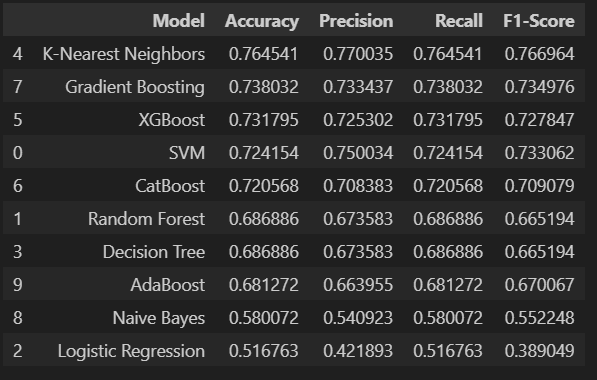
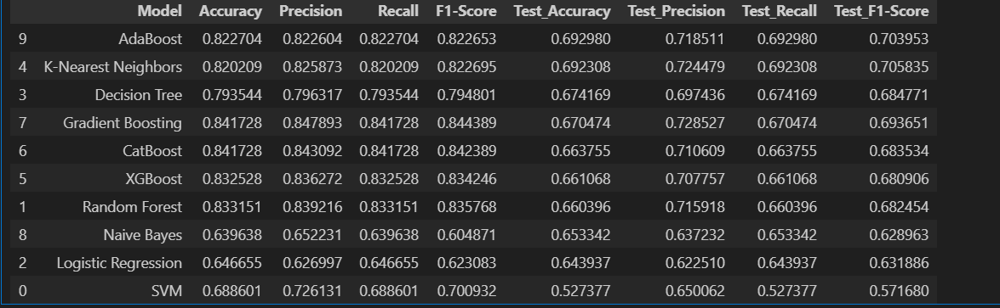

# Assignment 2: USEReady ML Project

## Project Overview

The primary objective of this project is to develop a machine learning model capable of predicting the "Load_Type" of a power system based on historical data. The "Load_Type" categorization includes "Light_Load", "Medium_Load", and "Maximum_Load". This classification problem requires candidates to apply their skills in data preprocessing, exploratory data analysis (EDA), feature engineering, model selection, and model evaluation to predict the load type accurately.

## Project Progress

- **Exploratory Data Analysis (EDA):** The initial phase involved performing EDA on the dataset, which was documented in the _**EDA.ipynb**_ file. This involved formatting the Date_Time column appropriately, extracting NSM (Number of Seconds from Midnight) values to understand the timing, and creating plots to visualize the data distribution and relationships. Initial models were built based on three attributes, resulting in an accuracy of 77% shown in _**ml_model_bulding.ipynb**_ in validation dataset.



- **Model Building and Evaluation:** Despite achieving decent performance on the training data, the models performed poorly on the validation dataset. To address this issue, additional attributes in the dataset were subjected to imputation and feature engineering. These enhancements were discussed in detail, along with plots and assumptions. Subsequently, a new model was built in the _**ml_model_building2.ipynb**_ notebook, resulting in an improved accuracy of 83% in validation dataset.

  - The test dataset yields a 69% accuracy with adaboost classifier by training the whole training and validation dataset.





## Dataset Splitting

The test dataset consists of the last month of data from 2018. Out of the remaining months, 20% is allocated as the validation dataset, while the rest is used for training the model.

## Streamlit App run:

To execute the Streamlit application, run the following command in your terminal:

```
streamlit run app.py
```
Make sure you're in the directory where your app.py file is located. This command will start the Streamlit server and open your web browser with the running application. You can then interact with the application through the browser interface.

# Local Setup Output in Streamlit